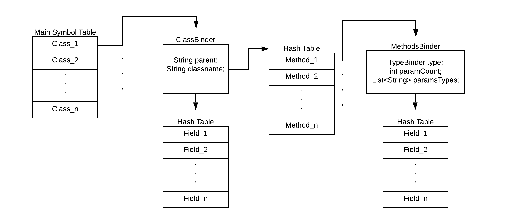

# CS179E Phase 1: Type-Checking
by Brandon Yi

## Requirements and Specifications

​	Phase 1 of this project is required to type check a MiniJava program. Given a MiniJava program, the type-checker must print out `Program type checked successfully` if there is no type error. However, if there is a type error, the program must print out `Type error`. The program takes the MiniJava program in from standard input.

​	Phase 1 uses JTB and JavaCC to create a syntax tree and visitor classes. The generated visitor classes allow easy traversal of the aforementioned syntax tree. My program uses modified versions of the generated `DepthFirstVisitor` and `GJDepthFirst` visitors.

## Design

### Overview

​	My implementation does two passes over the source code: the first pass constructs the symbol table and the second pass uses the symbol table to type check the expressions and statements. The details of these structures will be described below.

### Symbol Table Design



​	The symbol table is multi-layered. Each level of the symbol table uses a hash table to store `Binder`s which are the data structures that contain information about the identifier stored in the hash table.  Each `Binder` class contains information unique to the identifier's type and a `Symbol` which stores the name of the identifier. The `Symbol` class is used to determine where in the hash table the `Binder` is stored.

​		The first level stores an extended class of `Binder` called `ClassBinder`; The `ClassBinder` contains the name of parent of the identifiers's class (i.e. the classname after `extends`), the identifier's classname and two hash tables. The first hash table is used to store the fields of the class. Each of the identifiers stored in the first hash table have a `Binder`  for their respective type (e.g. `IntBinder`, `BoolBinder`, `ArrayBinder` or `ClassBinder`). The second hash table is used to store `MethodBinder`s.

​	The hash table of `MethodBinder`s contains all of the information about each method in the class's definition. The `MethodBinder` class contains a `TypeBinder` which indicates the return type of the current method. It also stores information about the amount and types of input parameters the method accepts. Finally, the `MethodBinder` stores `Binder`s for each field in the method where each `Binder` is a `Binder` of the identifiers respective type.

### First Pass: SymbolTableConstructor

​	The class `SymbolTableConstructor ` constructs the symbol table. It extends the `DepthFirstVisitor`  visitor that was automatically generated by JTB and JavaCC. It keeps track of the scope of the program by storing two `Binder`s: `currClass` and `currMethod`. This allows the `SymbolTableConstructor` to correctly identify which class's and/or method's symbol table it should search for an identifier in. For example, this is how a variable declaration is handled:

```java
public void visit(VarDeclaration n) {
    n.f0.accept(this);
    n.f1.accept(this);
    n.f2.accept(this);

    if (currMethod == null) {
      if (currClass.myItems.alreadyExists(Symbol.symbol(idName(n.f1))))
        RegTypeError();

      if (n.f0.f0.choice instanceof IntegerType)
        currClass.myItems.put(Symbol.symbol(idName(n.f1)), new IntBinder());
      if (n.f0.f0.choice instanceof BooleanType)
        currClass.myItems.put(Symbol.symbol(idName(n.f1)), new BoolBinder());
      if (n.f0.f0.choice instanceof ArrayType)
        currClass.myItems.put(Symbol.symbol(idName(n.f1)), new ArrayBinder());
      if (n.f0.f0.choice instanceof Identifier)
        currClass.myItems.put(Symbol.symbol(idName(n.f1)), new ClassBinder(((Identifier) n.f0.f0.choice).f0.toString()));
    } else {
      if (currMethod.myItems.alreadyExists(Symbol.symbol(idName(n.f1))))
        RegTypeError();

      if (n.f0.f0.choice instanceof IntegerType)
        currMethod.myItems.put(Symbol.symbol(idName(n.f1)), new IntBinder());
      if (n.f0.f0.choice instanceof BooleanType)
        currMethod.myItems.put(Symbol.symbol(idName(n.f1)), new BoolBinder());
      if (n.f0.f0.choice instanceof ArrayType)
        currMethod.myItems.put(Symbol.symbol(idName(n.f1)), new ArrayBinder());
      if (n.f0.f0.choice instanceof Identifier)
        currMethod.myItems.put(Symbol.symbol(idName(n.f1)), new ClassBinder(((Identifier) n.f0.f0.choice).f0.toString()));
    }
  }
```

The `SymbolTableConstructor` class adds each identifier - no matter what scope it is it - to the appropriate level in the symbol table. If an identifier is declared more than once, a `RegTypeError()` function is called.

### Class Dependency Cycle Detection

​	Before the second pass can start, the type-checker constructs a graph of how each class depends on each other (i.e. `class A extends B` produces a graph like `B -> A`). Class dependencies can be calculated from the first level of the symbol table by looking at the `parent` attributes of each `ClassBinder` stored in this level. 

​	The cycle detection algorithm navigates the graph that was constructed and marks each node it sees as visited. If the algorithm visits a node that it has already marked as visited, the algorithm reports that it found a cycle in the graph. If a cycle is found in the graph, `RegTypeError()` is called and the type checker does not proceed further. Otherwise, the second pass begins.

### Second Pass: CheckVisitor

​	The `CheckVisitor` class uses the symbol table that was constructed in the first pass to get the type of every identifier it sees. It keeps track of the scope of the program by storing two Binders: `currClass` and `currMethod`. This allows the `CheckVisitor` to correctly identify which class's and/or method's symbol table it should search for an identifier in. 

​	The `CheckVisitor` class extends the `GJDepthFirst`  visitor which was automatically generated by JTB and JavaCC. Since the `CheckVisitor` extends the `GJDepthFirst` visitor, it returns a `String/R` which corresponds to the type of the expression currently being checked. For example:

```java
public R visit(ThisExpression n) {
        R _ret=null;
        n.f0.accept(this);

        String currClassname = currClass.classname;

        // Does the class actually exist in the symbol table?
        if (symbolTable.get(Symbol.symbol(currClassname)) == null)
            RegTypeError();

        _ret = (R)currClassname;

        return _ret;
}
```

The `CheckVisitor` class implements the type judgements as described by the MiniJava Type System. If a violation of these judgements is found, `RegTypeError()` is called.

## Testing and Verification

